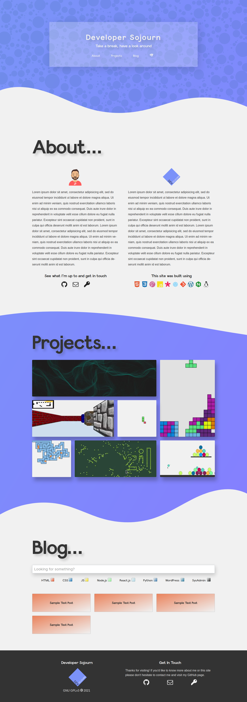
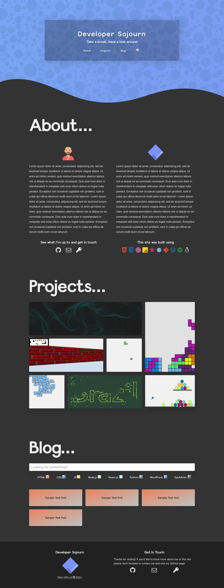

# Welcome

[Developer Sojourn](https://developersojourn.site) is a place to relax, enjoy and learn throughout experimentation. I attempt to put in practice everything that I learn about programming for the web, from exiting visual effects to programming paradigms (less obvious but equally important skill).

I also write about my personal experience learning how to write code and other technologies not directly related to the online world. These are mostly notes I've compiled on topics such as Node.js, shell scripting, game development, etc...

This portfolio is a work in progress and it always will, as I move things around, add new technologies to the stack and find other overly complicated ways to have some fun with code.

Any feedback on my work is much appreciated, as well as any tips on how to improve my coding and designing skills. Or you can just write me to say hi. You will find my details inside so make sure to pay a visit!

## Light Theme:

## Dark Theme:

