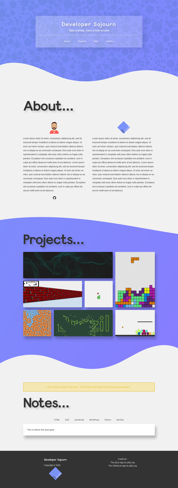

# Welcome

[Developer Sojourn](https://developersojourn.site) is a place to relax, enjoy and learn throughout experimentation. I attempt to put in practice everything that I learn about programming for the web, from exciting visual effects made with libraries like P5.js to less obvious but equally important coding best practices.

This portfolio is a work in progress and it always will, as I move things around, add new technologies to the stack and find other overly complicated ways to have some fun with code.

I appreciate any feedback on how to improve my coding and designing skills, or you can also just reach me if you want to say hi. You will find my details inside so make sure to pay a visit!

